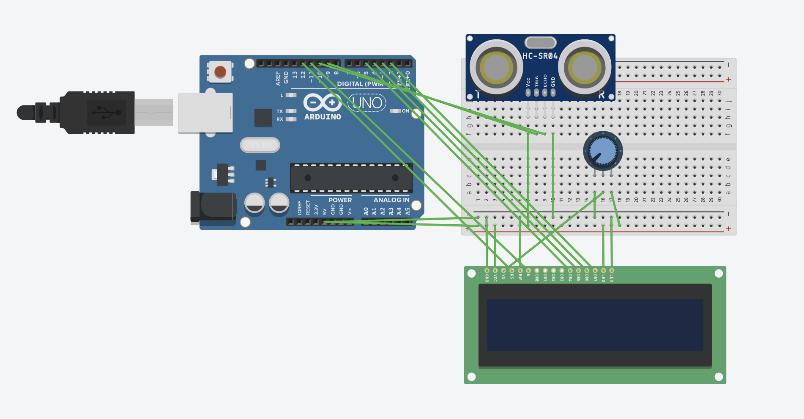

# Arduino Distance Monitor with LCD

## Overview
This project demonstrates a basic embedded system that measures distance using an ultrasonic sensor and displays real-time data on a 16x2 LCD screen.

## Components Used
- Arduino Uno
- HC-SR04 Ultrasonic Sensor
- 16x2 LCD Display
- Potentiometer
- Jumper Wires

## Pin Connections

### HC-SR04
- VCC → 5V
- GND → GND
- TRIG → Pin 9
- ECHO → Pin 10

### LCD
- GND → GND
- VDD → 5V
- VO → Potentiometer middle pin
- RS → Pin 12
- RW → GND
- E → Pin 11
- D4 → Pin 5
- D5 → Pin 4
- D6 → Pin 3
- D7 → Pin 2
- BLA → 5V
- BLK → GND

## How It Works
The ultrasonic sensor sends sound waves and measures the time it takes for the echo to return. The Arduino calculates the distance and displays it on the LCD screen in real time.

## Features
- Real-time distance measurement
- Simple embedded system design
- Distance measurement range: ~2cm to 400cm
- Real-time LCD display output
- Uses ultrasonic sensing (HC-SR04)
- Refresh rate: ~2-3 measurements per second

## Demo

## Circuit Diagram

## Code Explanation
The Arduino triggers the ultrasonic sensor, measures the echo duration using `pulseIn()`, calculates the distance in centimeters, and displays the result on the LCD.

## Author
Hasan Ali Kınaş
